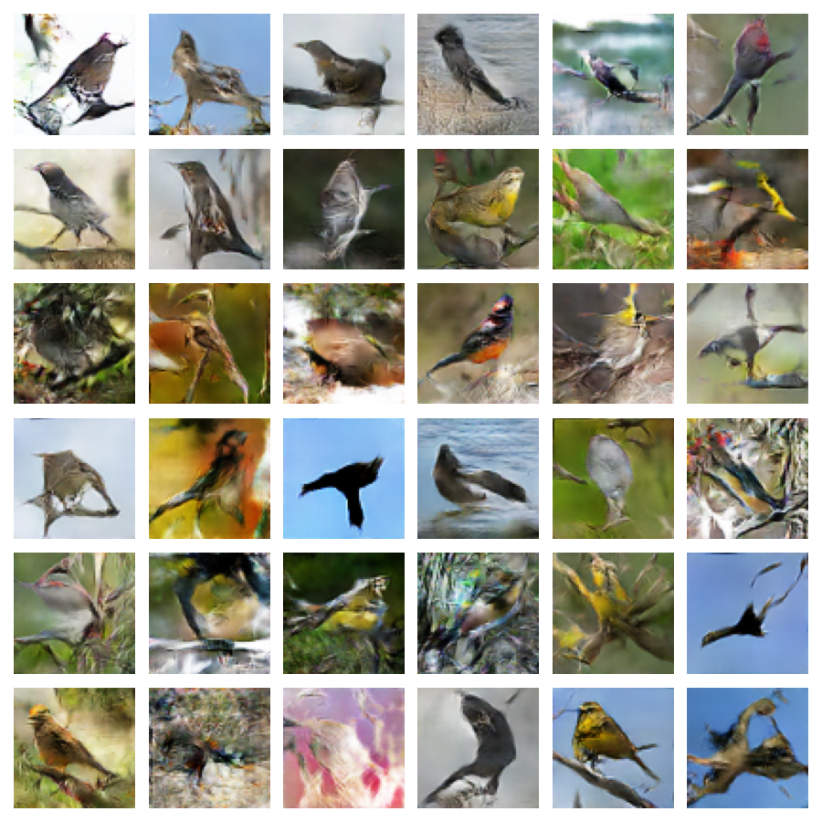
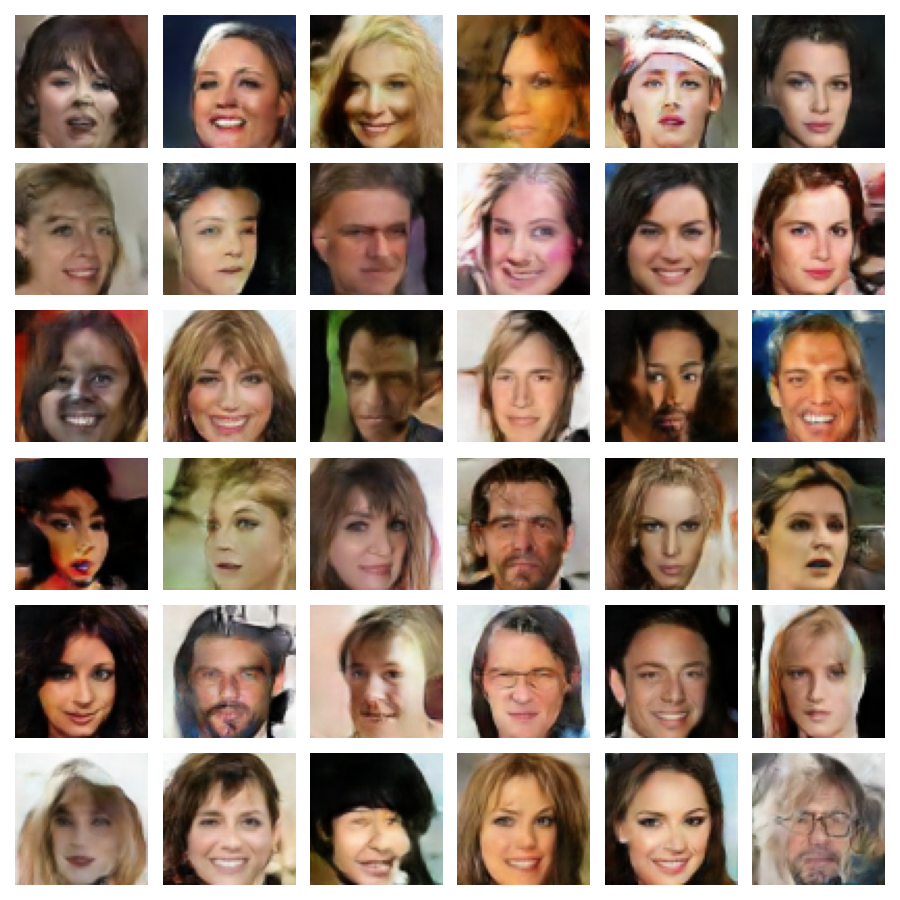

# GAN Flavours: Comparison of GAN Losses and Architectures with Keras

This repository contains:
1. A simple DCGAN model with a flexible configurable architecture along with the following avaliable losses (in [losses.py](losses.py)):
    * [Minimax loss](https://arxiv.org/abs/1406.2661)
    * [Non-saturating loss](https://arxiv.org/abs/1406.2661)
    * [Least squares loss](https://arxiv.org/abs/1611.04076)
    * [Hinge loss](https://arxiv.org/abs/1705.02894)
    * [Wasserstein loss](https://arxiv.org/abs/1701.07875)
2. An implementation of [Adaptive Discriminator Augmentation](https://arxiv.org/abs/2006.06676) for training GANs with limited amounts of data. It was used for ablations and hyperparameter optimization for the corresponding [Keras code example](https://keras.io/examples/generative/gan_ada/).
3. An implementation of [Kernel Inception Distance (KID)](https://arxiv.org/abs/1801.01401), which is a GAN performance metric with a simple unbiased estimator, that is more suitable for limited amounts of images, and is also computationally cheaper to measure compared to the [Frechet Inception Distance (FID)](https://arxiv.org/abs/1706.08500). Implementation details include (all being easy to tweak):
    * The Inceptionv3 network's pretrained weights are loaded from [Keras applications](https://keras.io/api/applications/inceptionv3/).
    * For computational efficiency, the images are evaluated at the minimal possible resolution (75x75 instead of 299x299), therefore the exact values might not be comparable with other implementations.
    * For computational efficiency, the metric is only measured on the validation splits of the datasets.

## Caltech Birds 2011 (CUB-200)

* 6000 training images
* 400 epoch training
* 64x64 resolution, cropped on bounding boxes
* adaptive discriminator augmentation not used for better comparability

KID results (the lower the better):

Loss / Architecture | Vanilla DCGAN | Spectral Norm. | Residual | Residual + Spectral Norm.
--- | --- | --- | --- | ---
Non-saturating GAN | 0.087 | 0.184 | 0.479 | 0.533
Least Squares GAN | 0.114 | 0.153 | 0.312 | 0.361
Hinge GAN | 0.123 | 0.238 | 0.165 | 0.304
Wasserstein GAN | * | 1.066 | * | 0.679

Images generated by a vanilla DCGAN + non-saturating loss:

## CelebFaces Attributes (CelebA)

* 160.000 training images
* 25 epoch training
* 64x64 resolution, center cropped

KID results (the lower the better):

Loss / Architecture | Vanilla DCGAN | Spectral Norm. | Residual | Residual + Spectral Norm.
--- | --- | --- | --- | ---
Non-saturating GAN | 0.015 | 0.044 | 0.016 | 0.036
Least Squares GAN | 0.017 | 0.036 | 0.014 | 0.036
Hinge GAN | 0.015 | 0.041 | 0.020 | 0.036
Wasserstein GAN | * | 0.058 | * | 0.061

Images generated by a vanilla DCGAN + non-saturating loss:

*Based on theory, Wasserstein GANs require Lipschitz-constrained discriminators, and therefore they are only evaluated with architectures using spectral normalization in their discriminators.

## Findings

After comparing GAN losses across architectures and datasets, my findings are in line with the findings of the [Are GANs Created Equal?](https://arxiv.org/abs/1711.10337) study: no loss outperforms the non-saturating loss consistently. The training dynamics show similar stability, and the generation quality is also similar across the losses. Wasserstein GANs seem to be underperforming in comparison to the others, though the hyperparameters used might be suboptimal, as they follow mostly the [DCGAN](https://arxiv.org/abs/1511.06434) paper. **I recommend using the non-saturating loss as a default**.

## Image augmentations

In this implementation, [RandomFlip](https://keras.io/api/layers/preprocessing_layers/image_augmentation/random_flip/), [RandomTranslation](https://keras.io/api/layers/preprocessing_layers/image_augmentation/random_translation/), [RandomRotation](https://keras.io/api/layers/preprocessing_layers/image_augmentation/random_rotation/) and [RandomZoom](https://keras.io/api/layers/preprocessing_layers/image_augmentation/random_zoom/) are used for image augmentation when applying [Adaptive Discriminator Augmentation](https://arxiv.org/abs/2006.06676), because in the paper these "pixel blitting" and geometric image augmentations are shown to be the most useful (see figures 4a and 4b). One can add other augmentations as well, using the custom Keras augmentations layers of [this repository](https://github.com/beresandras/image-augmentation-layers-keras) for example, which implements color jitter, additive gaussian noise and random resized crop among others in a differentiable and GPU-compatible manner.